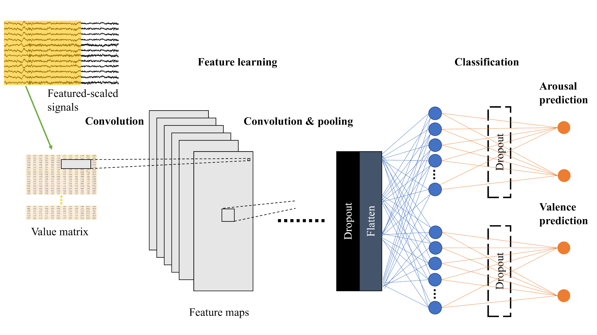

# CNN Implementation for EEG-Emotion Recognition during Music Listening
[link](https://arxiv.org/abs/1910.09719)

This repository is a part of EEG-Emotion Recognition Research.  It manifests models used in our experiments.



## Models
There are 4 CNN architectures (3Conv - 6Conv).  You can see Keras implementation in /typicalModels.  Also, we have tested 3D physical electrode placement.  In this experiment, we had to adjust the models to fit the new input's size.  You can find these modified models in /3DModels.

<table>
  <tr>
    <th colspan=2>3Conv</th>
    <th colspan=2>4Conv</th> 
    <th colspan=2>5Conv</th>
    <th colspan=2>6Conv</th>
  </tr>
  <tr>
    <td colspan=2>Conv2D 5x5x32</td>
    <td colspan=2>Conv2D 5x5x32</td>
    <td colspan=2>Conv2D 5x5x32</td>
    <td colspan=2>Conv2D 5x5x32</td>
  </tr>
  <tr>
    <td colspan=2>Conv2D 3x3x32</td>
    <td colspan=2>Conv2D 3x3x32</td>
    <td colspan=2>Conv2D 2x2x32</td>
    <td colspan=2>Conv2D 2x2x32</td>
  </tr>
  <tr>
    <td colspan=2>MaxPooling2D 2x2</td>
    <td colspan=2>MaxPooling2D 2x2</td>
    <td colspan=2>Conv2D 2x2x32</td>
    <td colspan=2>Conv2D 2x2x32</td>
  </tr>
  <tr>
    <td colspan=2>Conv2D 3x3x64</td>
    <td colspan=2>Conv2D 2x2x64</td>
    <td colspan=2>MaxPooling2D 2x2</td>
    <td colspan=2>MaxPooling2D 2x2</td>
  </tr>
  <tr>
    <td colspan=2>Dropout 0.5</td>
    <td colspan=2>Conv2D 2x2x64</td>
    <td colspan=2>Conv2D 2x2x64</td>
    <td colspan=2>Conv2D 2x2x64</td>
  </tr>
  <tr>
    <td>FC 128x1</td>
    <td>FC 128x1</td>
    <td colspan=2>Dropout 0.5</td>
    <td colspan=2>Conv2D 2x2x64</td>
    <td colspan=2>Conv2D 2x2x64</td>
  </tr>
  <tr>
    <td>Dropout 0.5</td>
    <td>Dropout 0.5</td>
    <td>FC 128x1</td>
    <td>FC 128x1</td>
    <td colspan=2>Dropout 0.5</td>
    <td colspan=2>Conv2D 2x1x64</td>
  </tr>
  <tr>
    <td>FC 2x1</td>
    <td>FC 2x1</td>
    <td>Dropout 0.5</td>
    <td>Dropout 0.5</td>
    <td>FC 128x1</td>
    <td>FC 128x1</td>
    <td colspan=2>Dropout 0.5</td>
  </tr>
  <tr>
    <td></td>
    <td></td>
    <td>FC 2x1</td>
    <td>FC 2x1</td>
    <td>Dropout 0.5</td>
    <td>Dropout 0.5</td>
    <td>FC 128x1</td>
    <td>FC 128x1</td>
  </tr>
  <tr>
    <td></td>
    <td></td>
    <td></td>
    <td></td>
    <td>FC 2x1</td>
    <td>FC 2x1</td>
    <td>Dropout 0.5</td>
    <td>Dropout 0.5</td>
  </tr>
  <tr>
    <td></td>
    <td></td>
    <td></td>
    <td></td>
    <td></td>
    <td></td>
    <td>FC 2x1</td>
    <td>FC 2x1</td>
  </tr>
</table>

## Citation
If you find the code useful for your research, please cite our paper:

```
@article{keelawat2019,
  title={Spatiotemporal Emotion Recognition using Deep CNN Based on EEG during Music Listening},
  author={Panayu Keelawat, Nattapong Thammasan, Masayuki Numao and Boonserm Kijsirikul},
  journal={arXiv preprint arXiv:1910.09719},
  year={2019}
}
```
